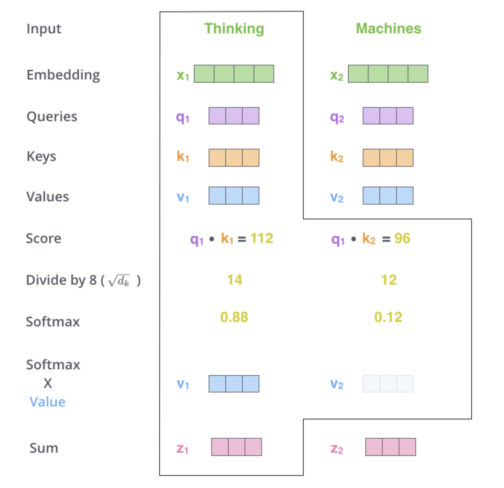

# Review-NLP-1

Review of the things I learnt for NLP

I had almost zero deep learning exprience except basic knowledge of MLP before. The purpose of this repository is to help me review and setup a good routine for me to ruminate things I learnt in a particular period of time. Also, a practice of english writting :)

## Transformer
Clarification: Transformer specifically means the model; Transformers often mean the library created by hugging face that has a collection of models that based on Transformer (might be wrong).

### What is **Transformers**?

In 2017, a paper attracted everyone's _attention_ : "Attention is All You Need"

[original paper](https://arxiv.org/abs/1706.03762) Here is the original paper of Transformers.

We can follow the giants and have a peak of what is transformers from their paper. However, honestedly, I don't like the paper as a beginner in NLP, or Deep Learning in general because there are too many unfamiliar words for me. Luckily, I found several useful videos to help me first build a general understanding of the paper.

1. [Hugging Face NLP Course](https://huggingface.co/learn/nlp-course/chapter1/1)
2. [李沐的论文解读](https://www.bilibili.com/video/BV1pu411o7BE/)
3. [Jalammar's illustrated description of transformer](https://jalammar.github.io/illustrated-transformer/)

I will explain how to use these three resources in a second.

Before understanding transfomers, We need to understand what is **NLP**? or what's the pipeline of doing an NLP task?

In my understanding, There are two types of NLP tasks:

1. NLU aka Natural Language Understanding
2. NLG aka Natural Language Generating

For **NLU**, the main purpose is to make the models/machine have the ability to understand the natural language. For example, in the scenario of custom service, when the model receives "This product sucks, I don't want to see it at all", we want it to generate an output as "negaive". This kind of task is called **_Sentimental Analysis_**. There are many other types of NLU tasks.

For **NLG**, the main purpose is to make the models/machine have the ability to transfer the information to the a human-readable language such as English or Chinese. The most famous and usual example of NLG tasks will be chatbot, and ChatGPT is the best chatbot (in my understanding)

Okay, Now let's imagine what will a general NLP task be according to what we have learnt:

Raw Data (A LOT OF TEXTS or EMOJIS) -> process -> Data that Machine can deal with -> Predicts/Generate/Classifiy -> Output Data -> process -> Human Language

Pretty Simple huh, but there are a lot of things going on here. You can check out the Hugging Face website I presented above for an official pipeline. I will also do that in the later section. However, since the main focus is to introduce the model, I will skip the Data Processing part.

Transformers is only one of the tool that can perform well in some kinds of tasks (well..CV/NLP/Audio) at the middle of the pipeline above. For the illustration, I will use an example of machine translation tasks, which is also the original purpose written in the paper. It is the time for us to dive into Transformers.

### Tokenization

In the world of computer, machines communicate with each other through numbers, or more specifically, vectors. In this situation, we must transform the input string into vectors. In another word, we need to "tokenize" the text. If you don't want to understand the basic principal behind how to do that, you can just use the following format.

```
from transformers import AutoTokenizer

tokenizer = AutoTokenizer.from_pretrained("Model_Name/Path")
```

You need to download the transformers package first using pip or conda on your terminal or linux server

```
pip install transformers
```

AutoTokenizer can detect the model you want to use automatically, and then you can activate a instance of it to use it. Each model has its own corresponding tokenizer and you must use that one to make sure they speak the same language.

Then

```
inputs = tokenizer(text)
```

For transformer, the tokenizer first split the sentences into subwords. What is subwords? There are three ways to "split" the words, "word-based", "character-based" and "subword tokenization". It just means split into words, characters, or subwords. For comparision, "Do Tokenization" becomes "[Do] [Tokenization]", "[D][o][T][o][k][e][n][i][z][a][t][i][o][n]" and "[Do] [token] [ization]". How to deternmine which part of words to split? That depends on the frequency of the subparts in context. 

There are many other methods for tokenizations, and we can spend a week just talking about how to tokenize the words. For now, just remember some classical and elegant ways to split the words. 

After that, the tokenizer will transform these subwords into vectors.

Notice that there are three things returned by the transformer tokenizer. They are **_input_ids_**, **_token_type_ids_**, and **_attention_mask_**. There is a corresponding vocabulary for each model, when you call the tokenizer for it, the tokenizer will know which vocabulary to use. The input_ids are the corresponding id (integer) of the text.

Using the example from Hugging Face

> ```
> tokenizer("Using a Transformer network is simple")
> {'input_ids': [101, 7993, 170, 11303, 1200, 2443, 1110, 3014, 102],
> 'token_type_ids': [0, 0, 0, 0, 0, 0, 0, 0, 0],
> 'attention_mask': [1, 1, 1, 1, 1, 1, 1, 1, 1]}
> ```

These three informations combined together to become the vectors that can represent the "semantic meanings" of the input, which means the vectors of "men" and "women" should be closer than "cat" or "dog" in a sense (Hopefully). 

Wait, how did the string become vectors??? This process is called embedding. In math, we can see this as a function f : String -> Vectors, a map from one set to another set. 

For transformers, the embedding works by adding the following things together:
1. token embeddings: the corresponding id for the token
2. token_type embedding: the tokens are in which sentence?
3. positional embedding: the calculated output according to the position of tokens in the sentence


As we can see in the photo, for the original paper, they used sine and cosine functions to calculate the value. This is one method of calculating positional embedding and the output ranged from -1 to 1 because of sine and consine functions. 

In order to fix the length of the inputs (representing the sequence of tokens), the transformer base model set up a max 512 dimensions, adding zero (this is called padding) for the one shorter than 512 and truncating the one longer than 512.

The token_type_ids represent which sentence the tokens are in, the same number means they are in the same sentence. In the text, there are some special tokens that we don't want the model to pay attention to, the attention mask will mark them as 0. 

Now we have everything we need for inputs of transformers. Irl, the embedding process is often done by the model and all we need to do is to provide the model with proper information, for example: "input_ids, token_type_ids, and attention_mask". 

### Transformer Architecture

The following is the transformer architecture.


After adding positional embedding, we moved to the large grey box here. Ignoring the fancy words such as multi-head attention for a minute, we can see that these two grey boxes are the main parts of the models. The left one is encoder, as its name, encoding the information learnt by the model; the right one is decoder, decoding the understanding of machine into human readable information. We can already know that the encoder is for the NLU, while the decoder is for the NLG by their names. 

Looking carefully at the grey boxes, someone can notice that there is a "***masked*** multi-head attention" in the decoder. This is extremely useful in generating text, because when a normal person speaks to others, he/she will speak according to what they have said instead of what they will say in the future (Attention! "they will say" does not mean the notion of what they are going to say in their mind, whlie it literally means the things they will spit out in the future). In addition, nobody will speak a whole sentence at one time, they will speak out words sequentially. However, the machine received all the encoded information at the same time, so the decoder masked the "future information" and let the machine decode the information one by one according to the previous information. 

For the machine translation task here, we needs both because we want the machine understands the text first, then generate the correct translation. This is called ***Encoder-Decoder*** Architecture. For tasks like sentimental analysis or text classification, where the model did not need to generate "natural language" but needs to understand the text, we can use ***Encoder Only*** architecture. A famous model, Bert, will be introduced later as the representative. In another way, GPT used ***Decoder Only*** to generate the information. 

Also, you can notice the ***Nx*** next to the grey boxes. each encoder or decoder is called a layer, (input -> layer -> output). Transformers used 6 identical layers, which means N = 6. The following is the illustrative graph from Jay Alammar's website:


A single token (transcripted into vectors) passed 6 encoder layers to generate understanding of the token, then passing to each decoder layer. Together with the "previous generated words", the decoder generate the next words in natural language. 

### Attention

Now, we will move to the most important part of transformer. The word "Multi-head" just means many replicate attentions, so we can first figure out what is attention. Here is an example used by Jay Alammar. 


In transformer, the model needs to compare the token with other tokens in the same sentence to understand the semantic meaning, just like reading through context. In this way, the model has three vital vectors, q (query), k (key), and v(value). All of them are corresponding to the same sentence with equal length. However, each of them contains different value (meanings). The vector on the right in the above picture is query, the model travers all the tokens of query and "compares" with the whole key find how much they are relative. Then, the author applies a division of 8 = sqrt(dimension of each token). The paper sets the dimension of each token as 64, using 64 "features" to represent each token. Then applys softmax, a function maps everything to 0-1, and multiply with the value vectors. Noticed that at this step, the token with lower softmax value will result lower weights after multiplication. 



Notice that "value" vector is not the score, the output of the whole calculation will be the scores, which captures the semantic meaning of a particular token according to context. For matrix multiplication: 


$$
softmax(\frac{Q \times K^{T}}{\sqrt{d_{k}}}) \times V = Z
$$

 
Z is the self-attention scores that we want.

Wait, how did we get these Q, K, V? For matrix multiplication, suppose X = Embedding we plugged into model:


$$
Q = X \times W_{q} ,  K = X \times W_{k} ,  V = X \times W_{v}
$$


Each of these weighted matrixes will be learnt by the model during tranining, starting with an random (based on my understanding) value or all 1. 

Combined all together, we have completed one self attention. For multi-head attention, we just compute attention seperately for number of "Head" times. In the paper, there are 8 heads, then we will get 8 outputs after multi-head attention , say Z*. Here we used another weighted matrix, still learnt during training, and get the final Z matrix.


$$
{Z*} \times W^{O} = Z
$$


This is the multi-head attention process happenning in each layer. However, only for the first encoder layer, we used embedding X. Remember we pass the output of the first encoder layer to the next layer. The other encoder layer will used the output of the previous encoder layer. 


In each encoder layer, there is a **residual connection** around it. Residual connection simply means to add the output with the original input together, in order to keep the original and important information whle learn the new things. In addition, rather than batch normalization, the transformers used **layer normalization**. Unlike usual batch normalization, Layer Normalization will make the model normalize accross the features, independently for each sample.


For Decoder, it has exactly same architecture with encoder except two things. 

First, the decoder will also accept the previous output ( by previous decoder layer), just like irl you will consider the next words you are going to say. 

Secondly, the decoder has a "masked multi-head attention". Altough we want the model generate the next token without bias from the "future tokens", the model recieved the "predictions of whole sentence" from the previous encoder layer as a whole. Then how does the transformer achieve this goal? The model will change the score of those "future tokens" (by checking their positions) to a huge negative number. In this way, the softmax function applied to them will mark them as 0, and machine will pay zero attention on them.


This is a general look of the whole process by Jay Alammar. 


